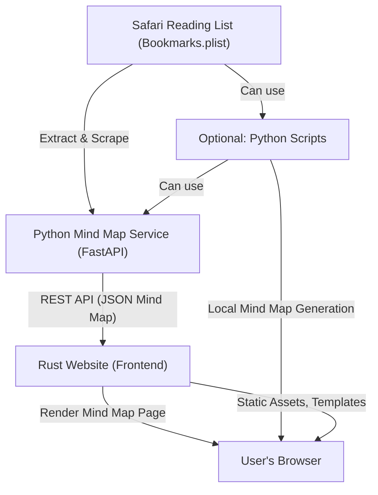

# Jambonne: Personal Website & Mind Map

This is my personal website, featuring a blog, CV, and a unique mind map visualization of my Safari reading list. The mind map is generated using a custom Python backend and displayed via a Rust web frontend.

- **Rust Website (Frontend):** Fast, type-safe web frontend that displays my mind maps, blog, and other content.
- **Python Mind Map Service (Backend):** FastAPI microservice for extracting, scraping, embedding, and clustering my reading list into mind maps.
- **(Optional) Python Scripts:** Legacy/standalone scripts for local mind map generation and visualization.

---

## Project Structure

- `src/` — Rust web application (frontend)
- `mindmap-service/` — Python FastAPI microservice (recommended backend)
- `scripts/` — Optional/legacy Python scripts for local use
- `templates/` — Shared HTML templates (Askama for Rust)
- `static/` — Static assets (CSS, fonts, etc.)

---

## System Overview



---

## Recommended Workflow

1. **Run the Python Mind Map Service**
   - See [`mindmap-service/README.md`](mindmap-service/README.md) for setup and API usage.
   - Deploy locally or on Railway.
2. **Start the Rust Website**
   - The site fetches mind map data from the Python service and renders it.
   - See [`rust-mindmap-integration.md`](rust-mindmap-integration.md) for integration details.
3. **(Optional) Use Python Scripts**
   - For local/offline mind map generation, see [`scripts/README.md`](scripts/README.md).

---

## Documentation

- **Backend Service:** [`mindmap-service/README.md`](mindmap-service/README.md)
- **Rust Integration Guide:** [`rust-mindmap-integration.md`](rust-mindmap-integration.md)
- **Legacy Scripts:** [`scripts/README.md`](scripts/README.md)
- **Project Structure:** [`project-structure.md`](project-structure.md)

---

## Quick Start

### 1. Mind Map Service (Python, FastAPI)
```bash
cd mindmap-service
uv sync
cp env.example .env  # Edit as needed
uv run uvicorn src.main:app --reload
```

### 2. Export Your Safari Reading List (optional but needed for reading page)
```bash
uv run python scripts/export_reading_list.py \
  --output static/data/reading_list.json
```
- Requires Full Disk Access for your terminal the first time you read `Bookmarks.plist`.
- Checks `~/Library/Safari/Bookmarks.plist`, extracts title/url/date, and writes JSON your site can embed or copy into a Docker image.
- Override the destination with `--output` or set the `READING_LIST_FILE` env var for the Rust server.
- When building Docker images, copy the exported JSON into the container so `/reading` works without macOS data access.

### 3. Rust Website
```bash
cargo run
# Visit http://localhost:3000/mindmap
```

---

## Contributing & Development
- See each subproject's README for development, testing, and deployment instructions.
- All Python and Rust code is formatted and linted using standard tools (see Makefiles and pyproject.toml).

---

## License
MIT 
